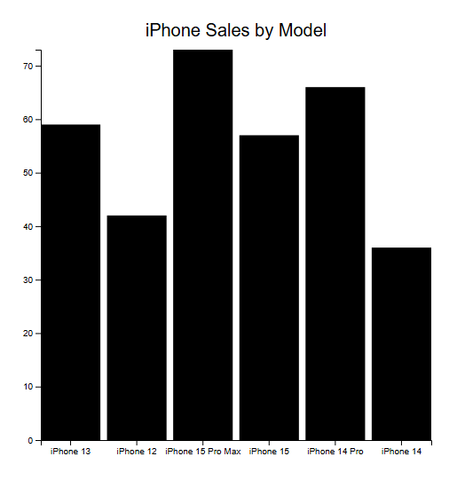

# D3 HW1

This project is creating a bar chart showing total iPhone sales by model.

## Dataset
[iPhone sales dataset loaded from an external CSV file from kaggle.com](https://www.kaggle.com/datasets/jawadaahmed/iphone-sales-analytics-dataset?resource=download)

## Visualization

Bar chart of total iPhone quantity sold by model.