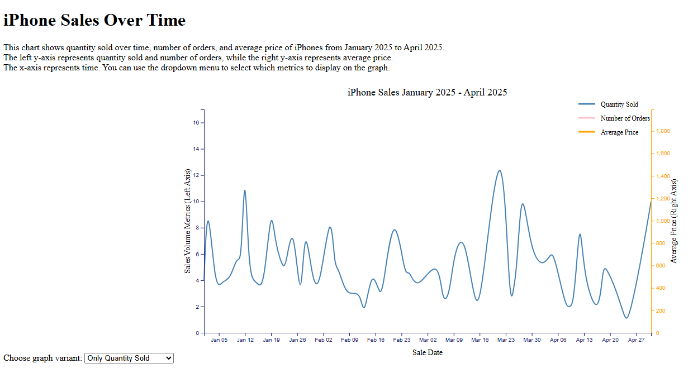
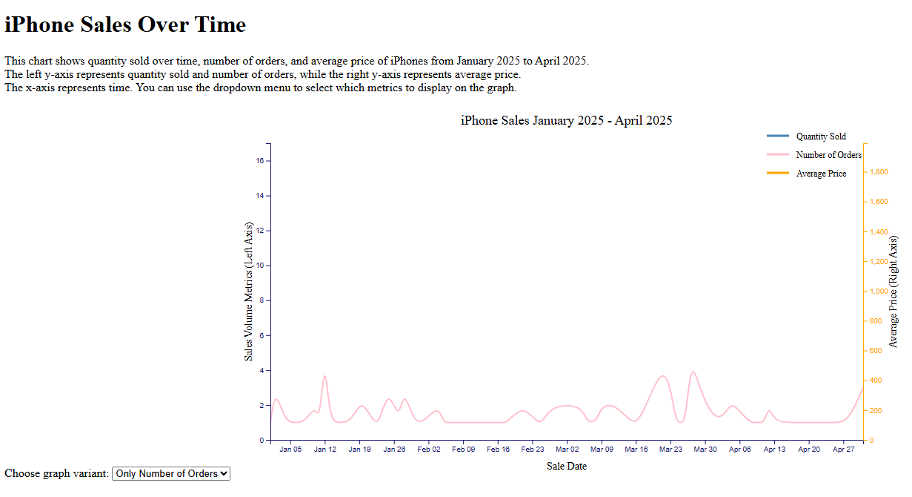
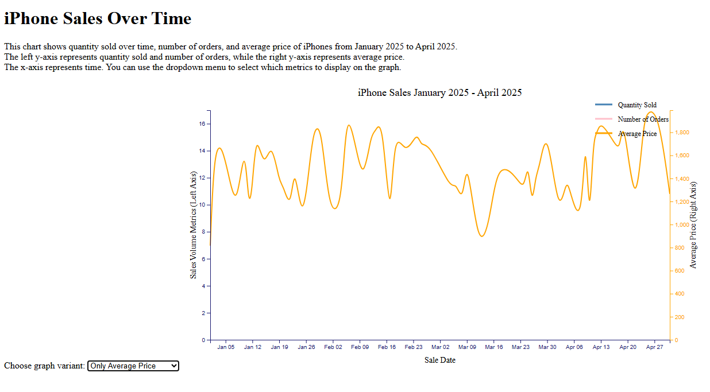
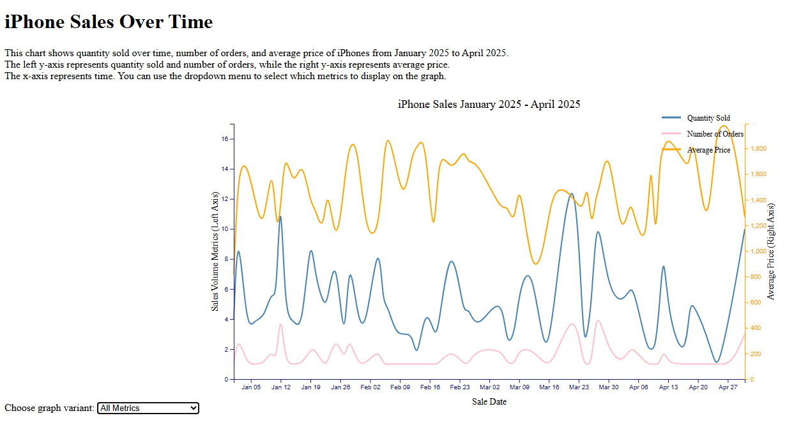
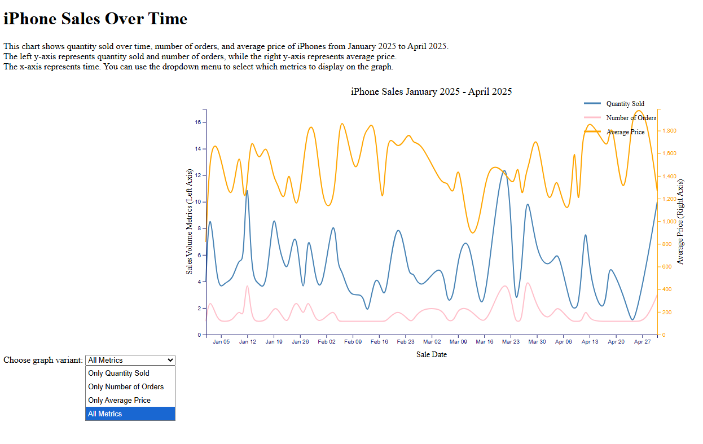

# D3 HW2

This project is creating a interactive multi-line chart showing most iPhone data from January 2025 until April 2025.

## Dataset
[iPhone sales dataset loaded from an external CSV file from kaggle.com](https://www.kaggle.com/datasets/jawadaahmed/iphone-sales-analytics-dataset?resource=download)

## Visualizations

This chart shows quantity sold over time, number of orders, and average price of iPhones from January 2025 to April 2025.
The left y-axis represents quantity sold and number of orders, while the right y-axis represents average price.
The x-axis represents time. You can use the dropdown menu to select which metrics to display on the graph.