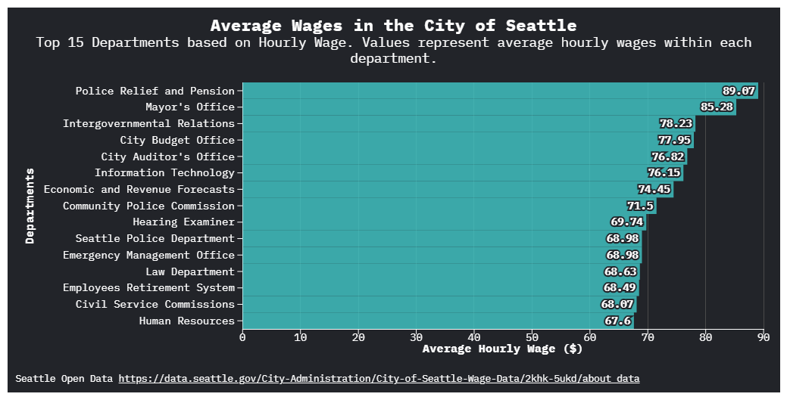

# Flourish 1

Dylan Lim

My visualization represents the average wages of each of the top 15 departments in the City of Seattle. I was able to determine the top
15 departments by filtering out all the departments that earned below the 15 highest earning departments in a pivot table on excel.

[Flourish Visualization Link](https://public.flourish.studio/visualisation/28546348/)