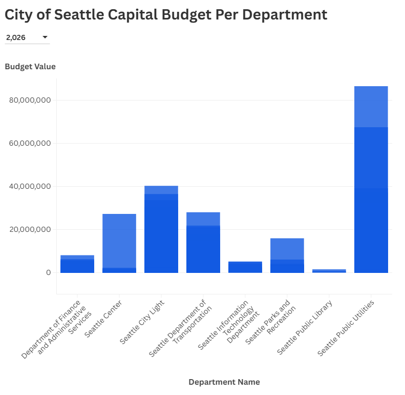

# Flourish 2

Dylan Lim

My visualization represents the budget of each department in the City of Seattle for each fiscal year. This dataset was a easier to work with dataset because the there were categories that didn't need to be aggregated in order for it to be made into a decent visualization that is easy to read, with potential to make it even better if the dataset was properly filtered down.

[Flourish Visualization Link](https://public.flourish.studio/visualisation/28546348/)